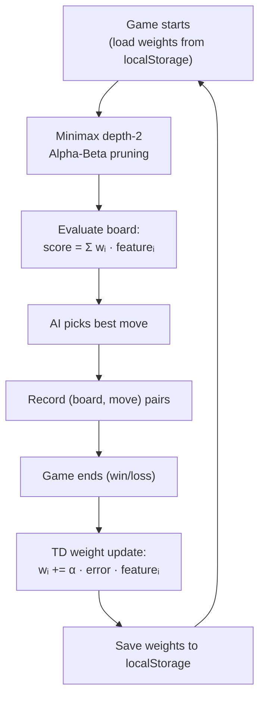

# Local Learning AI Rebuild

## Why not a neural network?

Neural networks need hundreds of games before weights shift enough to feel different. With only 15 games and no server, the improvement would be invisible to the human player.

**Better alternative: Minimax + Learnable Linear Evaluation (Temporal Difference Learning)**

- Minimax gives the AI strategic depth from game 1 (it thinks ahead)
- The evaluation function is a small set of weighted board features (~8 weights)
- After each game, TD learning nudges the weights toward the correct outcome
- 15 games × ~20 moves = ~300 weight update steps — enough for an 8-weight model to converge visibly
- No ML library needed — removes `@tensorflow/tfjs` (~500KB bundle savings)
- Weights stored in `localStorage` — persist between browser sessions

## How the AI improves

## Board features used in evaluation (8 total)

- Piece count difference (black - red)
- King count difference (×1.5 value)
- Black advancement (sum of rows — pushes forward)
- Center control (pieces on cols 2-5, rows 2-5)
- Back-row safety (pieces still on home row)
- Mobility (number of available moves)
- Capture threat (opponent capture opportunities)
- Trade advantage (when ahead, avoid trades; when behind, seek them)

## Files changed

**Deleted:**
- `frontend/src/ai/model.ts` — TF.js model loading
- `frontend/src/ai/experience.ts` — server posting
- `frontend/src/ai/encoding.ts` — TF.js feature vector
- `server/` directory — entire backend

**New files:**
- `frontend/src/ai/features.ts` — extracts the 8 board features as plain numbers
- `frontend/src/ai/minimax.ts` — alpha-beta minimax search (depth 2)
- `frontend/src/ai/weights.ts` — localStorage persistence + TD weight update

**Modified:**
- `frontend/src/ai/player.ts` — simplified: calls minimax, no TF.js
- `frontend/src/App.tsx` — remove `model`, `isSending`, `modelReady` state; replace with `gamesPlayed` from localStorage; update status messages
- `frontend/package.json` — remove `@tensorflow/tfjs` dependency

## What the player will experience

- **Games 1-5:** AI makes legal moves but misses obvious tactics — easy to beat (weights near initial values, high exploration)
- **Games 6-14:** AI starts protecting pieces, preferring captures, avoiding obvious blunders — noticeably harder
- **Game 15:** AI reaches a regular/medium level — consistent, punishes mistakes, but still beatable
- **Games 25-30:** AI reaches intermediate level — plans multi-move sequences, controls center, manages endgame
- **Returning player:** Picks up exactly where it left off — same weights, same `gamesPlayed` count shown in UI

The learning rate (α) and initial exploration will be tuned so the curve feels gradual — not a sudden jump — with the most noticeable improvement happening between games 5 and 15.
